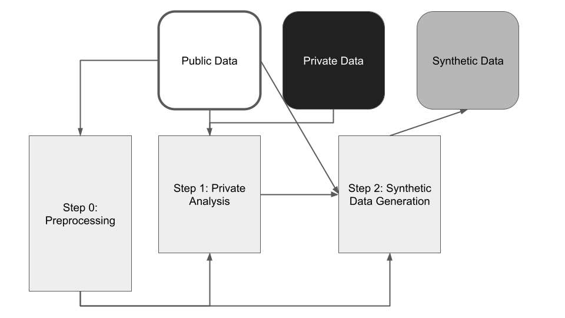

# GooseDP Solution to Differential Privacy Temporal Map Challenge (DeID2)-Sprint 3
## Brief Introduction
We are team GooseDP from the University of Waterloo. We finished the 5th in the [NIST Temporal Map Challenge: **Sprint 3**](https://www.drivendata.co/blog/differential-privacy-winners-sprint3/). This repository is our open-sourced solution to the challenge.

## Submission Repository Structure
    ├── Submission directory/
    │   ├── Step0_Archetype_Generation/             *Step-0: Preprocessing
    |       ├── Results_GMM/
    |       └── k_archetypes.py 
    │   ├── Step1_Archetype_Counting/               *Step-1: Private Analysis
    |       └── archetype_company_counts.py    
    │   ├── Step2_ Synthetic_Data_Generation/       *Step-2: Synthetic Record Generation
    |       ├── sample_triplets.py
    |       └── post_col_generation.py
    |   ├── data/                                   *Ground Truth Data and Parameters File
    |       ├── parameters.json
    |       └── ground_truth.csv
    |   ├── main.py                                 *Program Entrance
    |   ├── requirements.txt                        *Package Requirements
    |   ├── (Submission Write-up)

## Execution Commands
If you want to run our submission manually, first put the ground truth dataset (`ground_truth.csv` file) under the `data/`directory, and install the required packages.

>`pip install -r requirements.txt`

Then run the command to execute the main file.

>`python main.py`

## Code Guide
**Main Function**  (`main.py`)  
The program entrance to our code submission.  
*We create a script `create_submission.sh` to help zip our submission code files.*   
**Step 0: Preprocessing** (`Step0_Archetype_Generation/`)  
The preprocessing step in the write-up is corresponding to the contents in the `Archetype_Generation/`directory.   
Under this directory, the file `k_archetypes.py` is used for archetype generation and the generated archetype information files are stored in the `Results_GMM/` directory.  
*Note:* This step only uses the public dataset, therefore we create the archetype files locally and associate those files in the submission.   
**Step 1: Private Analysis** (`Step1_Archetype_Counting/`)  
The private analysis step in the write-up is corresponding to the contents in the `Archetype_Counting/`directory.  
Under this directory, the file `archetype_company_counts.py` is used for creating private histograms over the private dataset (details referring to the write-up) and returning privatized counts of taxis and companies.   

**Step-2:  Synthetic Data Generation**  (`Step2_sample_triplets/`)   

**Synthesize Taxi-trips Record** (`sample_triplets.py`)  
The synthetic record step in the write-up is corresponding to the contents in the `Step2_sample_triplets/`directory.  
Under this directory, the file `sample_triplets.py` is used for generating synthetic records for `('taxi_id', 'shift', 'company_id', 'pickup_community_area', 'dropoff_community_area')` columns.  
*Note:* We provide a bunch of method for sampling (`tr_mode` from 1-4), but we only use the mode 4, the one described in the write-up, for final submission.  
**Synthesize Other Columns**  (`post_col_generation.py`)  
The post processing step in the write-up is corresponding to the contents in the `Step3_nonprivate_gen/`directory.  
Under this directory, the file `cc_post_col_generation.py` is used for generating synthetic records for the rest of the columns, i.e., `('fare', 'trip_miles', 'trip_seconds', 'tips', 'trip_total', 'payment_type')`, based on the k-marginals.  

## Team Members: 
[Christian Covington](mailto:ccovington@uwaterloo.ca)  
[Karl Knopf](mailto:kknopf@uwaterloo.ca)   [Shubhankar Mohapatra](mailto:shubhankar.mohapatra@uwaterloo.ca)  [Shufan Zhang](mailto:shufan.zhang@uwaterloo.ca)  

